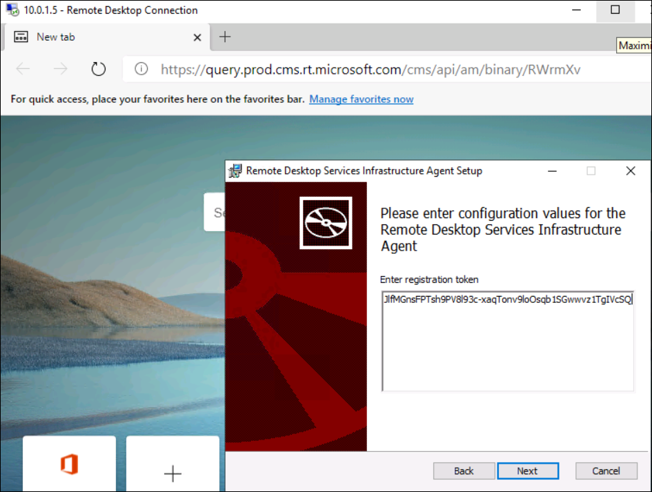
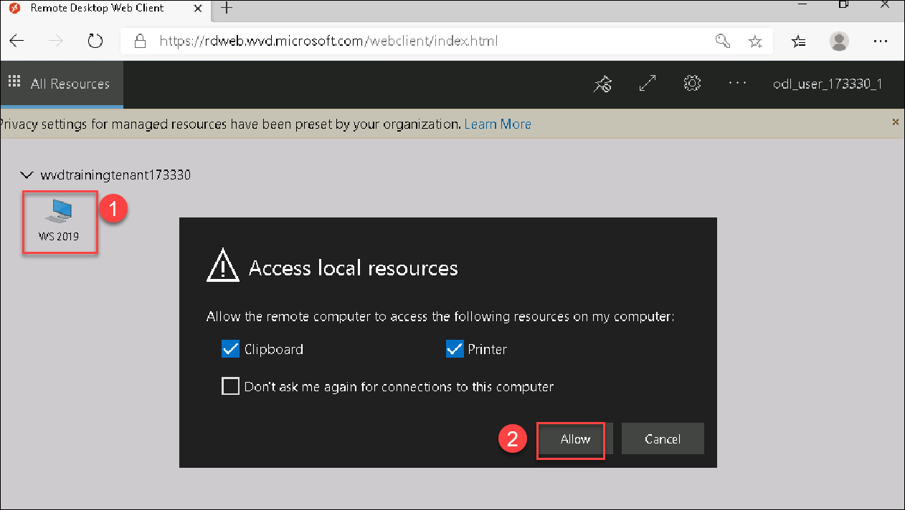

 # Register the virtual machines to the Windows Virtual Desktop host pool 

 **Registering the virtual machines to a Windows Virtual Desktop host pool is as simple as installing the Windows Virtual Desktop agents.** 

 **To register the Windows Virtual Desktop agents, do the following on the RDSH windows server**
  
  
1. Go to the Environment details page and copy the value of "**RDSH VM PrivateIP**"

1. On the Jumpvm, search for Remote Desktop Connection in Windows Search and open that.

1. RDP to the Windows Server 2019 Server using the copied RDSH Private IP

1.  Provide the following values and connect to the VM: 

       Username: **rdshuser**

       Password: **demoPassword1!!** 
       

  # On the RDSH Server, Download and install the Windows Virtual Desktop Agent. 

1.  Open a browser

1.  Download the **Windows Virtual Desktop Agent** 

       **https://query.prod.cms.rt.microsoft.com/cms/api/am/binary/RWrmXv**
       
1. Run the installer 

1.  When the installer asks you for the registration token, copy and paste in the value exported to the desktop file **token** in the previous step #10 

    

1.  Download and install the **Windows Virtual Desktop Agent Bootloader** 

       **https://query.prod.cms.rt.microsoft.com/cms/api/am/binary/RWrxrH**

1. Run the installer 

1. Minimize the **RDSHServer** RDP session 

 # Confirm host pool status is available 

1.  We can view details about our hostpool by running the following 

       **Get-RdsSessionHost -TenantName $tenant -HostPoolName $hostpoolname** 

       **Note**: Wait for agents to update  ~5 mins 

1. When the host pool **Status** is **Available**, continue to the next section 
       
   

 # Sign in to host pool interface 

1. Right click on **Edge** from the taskbar and select **New InPrivate Window** 

1. Go to **aka.ms/wvdweb**  

1. In the **Email, phone, or Skype** box, provide "WVD USER 1" email id and click **Next** 
      
1. In the Password box, Copy the password of "**WVD User 1**" from the user environment details page and enter it here and click **Sign in** 

1.  Click on **WS 2019**, click **Allow**, and log in with: 
    
    

      Username: Copy the value of "**WVD User 1**" from the user environment details page and enter it here

      Password: Copy the password of "**WVD User 1**" from the user environment details page and enter it here
    
1.  Once connected to the desktop, open task manager 

1. In task manager, click the More details button and then click on the Users tab, notice that your current user **WVD User 1** is connected to the RDSH server. 

      You have now logged in to the Windows Server 2019 RDSH session host.
       
       
