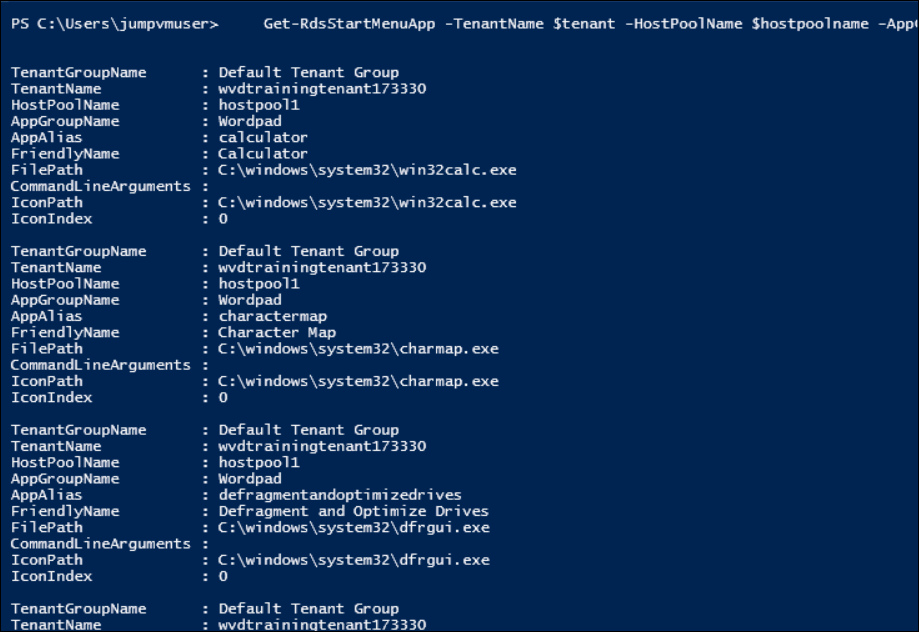
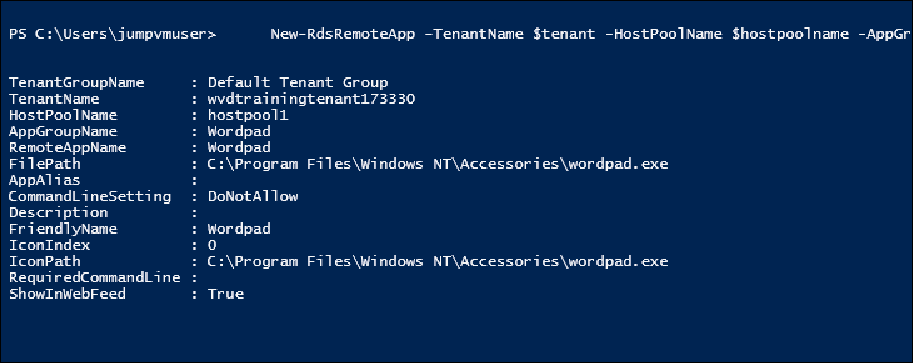
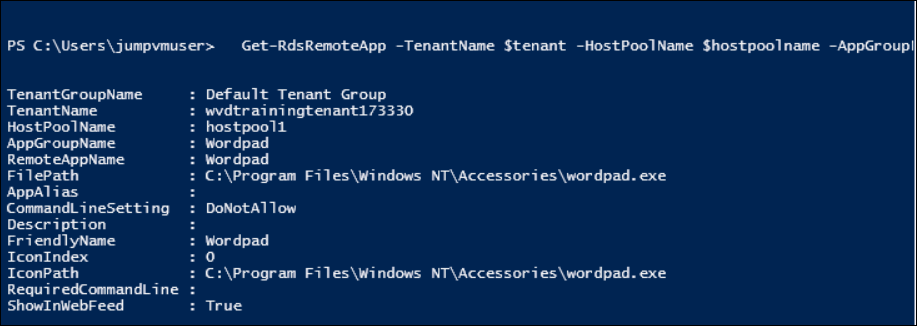
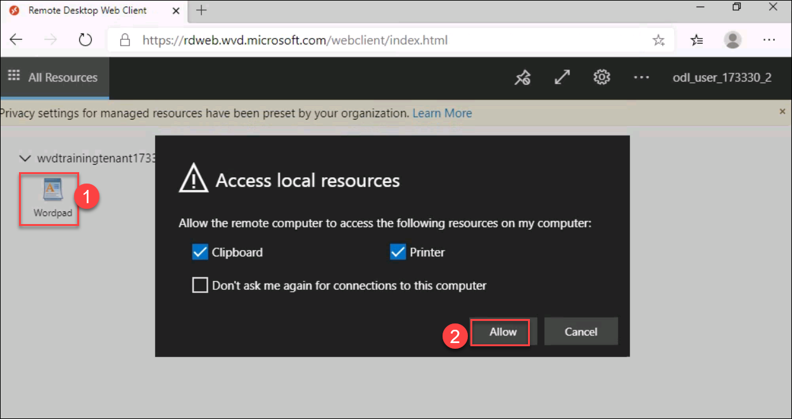

    
  # RemoteApps 
       
   Now that you've made a host pool, you can populate it with RemoteApps. To learn more about how to manage apps in Windows Virtual        Desktop, see the Manage app groups tutorial. 
   
  **Manage app groups tutorial**
  
  **https://docs.microsoft.com/en-us/azure/virtual-desktop/manage-app-groups**
  
  
  # Create a remote application group 
  
  The default app group, Desktop Application Group, created automatically for a new host pool publishes the full desktop. We can also     create one or more RemoteApp app groups for the host pool which will allow users to connect to an application installed in our host     pool. 
  
  In this example, we will create a new remote application group that will publish the Wordpad Desktop application. 
  
  1.  Run the following PowerShell cmdlet to create a new empty RemoteApp group. 
  
      ```sql
        New-RdsAppGroup -TenantName $tenant -HostPoolName $hostpoolname -Name Wordpad -ResourceType 
       RemoteApp
       ```
      

2.  To see a list of available applications in the host pool run the following command. 

      ```sql
      Get-RdsStartMenuApp -TenantName $tenant -HostPoolName $hostpoolname -AppGroupName Wordpad
      ```
    

3.  We can search for specific apps, and in this exercise we want to search for and create a remote app for our Wordpad users. 

      ```sql
     Get-RdsStartMenuApp -TenantName $tenant -HostPoolName $hostpoolname -AppGroupName Wordpad | ?{$_.FriendlyName -match "Wordpad"}
      ```
    
 
4.  In the next step, we will use the FilePath, IconPath, and IconIndex fto create our Wordpad Desktop remote app 

5. To add the Wordpad application to the remote app group run the following cmdlet.

```json
New-RdsRemoteApp -TenantName $tenant -HostPoolName $hostpoolname -AppGroupName Wordpad -Name Wordpad -Filepath "C:\Program Files\Windows NT\Accessories\wordpad.exe" -IconPath "C:\Program Files\Windows NT\Accessories\wordpad.exe"
```
   

6. Verify the app was published to the remote app group.

     ```sql
     Get-RdsRemoteApp -TenantName $tenant -HostPoolName $hostpoolname -AppGroupName Wordpad
     ```
    

     **Note**: You can add additional apps to this remote app group by repeating the above steps. 

7.  Now that we've created a remote app group and published the Wordpad app we can assign access to the group. 

8. Replace **"[userupn]"** with "**WVD User 2**" from the environment details page

     ```sql
      Add-RdsAppGroupUser -TenantName $tenant -HostPoolName $hostpoolname -AppGroupName Wordpad -UserPrincipalName "[userupn]"
     ```  
       
     Now that we've created a remote app and assigned access we can log in to the web client and open our published applications.
    
    
  # Sign in to Remote App interface 
  
1. Close the current browser window 

2. Right click on Edge from the taskbar and select **New InPrivate Window**

3. Go to **aka.ms/wvdweb**  

4. In the **Email, phone, or Skype** box, provide email id of "**WVD User 2**" and click **Next** 

5.  In the **Password** box, Copy the password of "**WVD User 2**" from the user environment details page and enter it here and click **Sign in** 

6. Click on **wordpad**, click **Allow**, and log in with: 

      Username: Copy the email id of "**WVD User 2**" from the user environment details page and enter it here

      Password: Copy the password of "**WVD User 2**" from the user environment details page and enter it here
      
   

      
